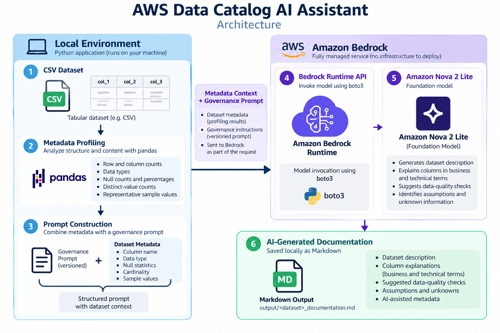

# AWS Data Catalog AI Assistant

A lightweight, dataset-agnostic metadata documentation assistant built with Python and Amazon Bedrock.

The project combines **Data Engineering**, **Metadata & Data Governance**, **Generative AI**, and **AWS** to automatically profile tabular datasets and generate AI-assisted technical documentation and data-quality suggestions.

The goal is deliberately simple: provide useful context to a foundation model without building an unnecessarily complex data platform.

## Problem

Data catalogs and governance initiatives often depend on metadata that is incomplete, inconsistent, or difficult for business and technical users to understand.

A foundation model can help generate documentation, but sending only column names and data types provides insufficient context and can lead to unsupported assumptions.

For example, an early experiment provided metadata similar to:

```text
customer_state: string
```

The model inferred that the column represented a **U.S. state**, even though no country had been provided.

This project therefore uses dataset profiling to provide additional evidence before invoking the foundation model.

Instead of:

```text
column name + data type
        ↓
      LLM
```

the application uses:

```text
column name
data type
null statistics
cardinality
sample values
        ↓
      LLM
```

Generated documentation is treated as **AI-assisted metadata**, not as authoritative catalog metadata.

## What the Project Does

Given a CSV dataset, the application:

1. Loads the dataset locally with pandas.
2. Profiles its structure and content.
3. Extracts metadata such as:
   - row and column counts;
   - inferred data types;
   - null counts and percentages;
   - distinct-value counts;
   - representative sample values.
4. Combines the generated metadata with a versioned governance prompt.
5. Sends the metadata context to Amazon Bedrock using the Bedrock Runtime API.
6. Uses Amazon Nova 2 Lite to generate:
   - a dataset description;
   - technical column explanations;
   - suggested data-quality checks;
   - explicit assumptions and unknown information.
7. Saves the generated documentation as Markdown.

The same application flow is used for different datasets without dataset-specific code.

## Project Structure

```text
aws-data-catalog-ai-assistant/
│
├── examples/
│   ├── nyc_311_sample.csv
│   ├── sales_by_state.json
│   └── titanic.csv
│
├── output/
│   ├── nyc_311_sample_documentation.md
│   └── titanic_documentation.md
│
├── prompts/
│   └── metadata_documentation_v1.txt
│
├── src/
│   ├── bedrock_client.py
│   ├── main.py
│   ├── metadata_profiler.py
│   ├── prompt_builder.py
│   └── prompt_loader.py
│
├── tests/
│   ├── test_bedrock_client.py
│   ├── test_metadata_profiler.py
│   └── test_prompt_builder.py
│
├── .gitignore
├── requirements.txt
├── requirements-dev.txt
└── README.md
```

## Requirements

- Python 3.14+
- AWS CLI configured with valid AWS credentials
- Access to Amazon Bedrock
- Access to Amazon Nova 2 Lite
- An AWS region compatible with the selected Bedrock inference profile

The project currently defaults to:

```text
AWS Region: us-east-1
Model: us.amazon.nova-2-lite-v1:0
```

Both values can be overridden using environment variables.

## Installation

Create a virtual environment:

```powershell
python -m venv .venv
```

Activate it on Windows PowerShell:

```powershell
.\.venv\Scripts\Activate.ps1
```

Install runtime dependencies:

```powershell
python -m pip install -r requirements.txt
```

For development and testing:

```powershell
python -m pip install -r requirements-dev.txt
```

Verify AWS authentication:

```powershell
aws sts get-caller-identity
```

## Usage

Run the assistant by providing a CSV file:

```powershell
python src\main.py examples\nyc_311_sample.csv
```

The application performs the complete flow:

```text
CSV
 ↓
Metadata profiling
 ↓
Prompt construction
 ↓
Amazon Bedrock
 ↓
AI-generated documentation
 ↓
Markdown output
```

The generated documentation is saved to:

```text
output\nyc_311_sample_documentation.md
```

A second dataset can be processed without modifying the application:

```powershell
python src\main.py examples\titanic.csv
```

which generates:

```text
output\titanic_documentation.md
```

This provides a simple validation that the core application is not tied to a single dataset or business domain.

## Architecture



The raw dataset is processed locally by the profiler. The application sends the resulting metadata context to Amazon Bedrock rather than sending the complete dataset.

## What the Project Does

Given a CSV dataset, the application:

1. Loads the dataset locally with pandas.
2. Profiles its structure and content.
3. Extracts metadata such as:
   - row and column counts;
   - inferred data types;
   - null counts and percentages;
   - distinct-value counts;
   - representative sample values.
4. Combines the generated metadata with a versioned governance prompt.
5. Sends the metadata context to Amazon Bedrock using the Bedrock Runtime API.
6. Uses Amazon Nova 2 Lite to generate:
   - a dataset description;
   - technical column explanations;
   - suggested data-quality checks;
   - explicit assumptions and unknown information.
7. Saves the generated documentation as Markdown.

The same application flow is used for different datasets without dataset-specific code.

## Project Structure

```text
aws-data-catalog-ai-assistant/
│
├── examples/
│   ├── nyc_311_sample.csv
│   ├── sales_by_state.json
│   └── titanic.csv
│
├── output/
│   ├── nyc_311_sample_documentation.md
│   └── titanic_documentation.md
│
├── prompts/
│   └── metadata_documentation_v1.txt
│
├── src/
│   ├── bedrock_client.py
│   ├── main.py
│   ├── metadata_profiler.py
│   ├── prompt_builder.py
│   └── prompt_loader.py
│
├── tests/
│   ├── test_bedrock_client.py
│   ├── test_metadata_profiler.py
│   └── test_prompt_builder.py
│
├── .gitignore
├── requirements.txt
├── requirements-dev.txt
└── README.md
```

## Requirements

- Python 3.14+
- AWS CLI configured with valid AWS credentials
- Access to Amazon Bedrock
- Access to Amazon Nova 2 Lite
- An AWS region compatible with the selected Bedrock inference profile

The project currently defaults to:

```text
AWS Region: us-east-1
Model: us.amazon.nova-2-lite-v1:0
```

Both values can be overridden using environment variables.

## AWS Bedrock Setup

Before running the application, Amazon Bedrock model access must be
configured manually in the target AWS account.

1. Sign in to the AWS Management Console.
2. Open Amazon Bedrock.
3. Select a supported region.
4. Open the model playground/model selection experience.
5. Select Amazon Nova 2 Lite.
6. Complete any model-access requirements presented by AWS.
7. Verify the model can respond successfully in the Bedrock playground.
8. Configure AWS CLI credentials for the identity that will run the application.
9. Run:
   aws sts get-caller-identity
10. Execute the application.

## Installation

Create a virtual environment:

```powershell
python -m venv .venv
```

Activate it on Windows PowerShell:

```powershell
.\.venv\Scripts\Activate.ps1
```

Install runtime dependencies:

```powershell
python -m pip install -r requirements.txt
```

For development and testing:

```powershell
python -m pip install -r requirements-dev.txt
```

Verify AWS authentication:

```powershell
aws sts get-caller-identity
```

## Usage

Run the assistant by providing a CSV file:

```powershell
python src\main.py examples\nyc_311_sample.csv
```

The application performs the complete flow:

```text
CSV
 ↓
Metadata profiling
 ↓
Prompt construction
 ↓
Amazon Bedrock
 ↓
AI-generated documentation
 ↓
Markdown output
```

The generated documentation is saved to:

```text
output\nyc_311_sample_documentation.md
```

A second dataset can be processed without modifying the application:

```powershell
python src\main.py examples\titanic.csv
```

which generates:

```text
output\titanic_documentation.md
```

This provides a simple validation that the core application is not tied to a single dataset or business domain.

## Prompt Strategy

The prompt is stored separately from the application code:

```text
prompts/metadata_documentation_v1.txt
```

This allows prompt behavior to be reviewed, tested, and versioned independently from the Python implementation.

The prompt establishes an evidence-oriented contract for the foundation model:

- supplied metadata is treated as the primary source of truth;
- missing descriptions or business definitions must not be converted into verified facts;
- inferred meanings should be identified as inferences;
- unknown information should remain explicitly unknown;
- geographic regions, currencies, formulas, relationships, and business processes should not be assumed without supporting metadata.

Prompt constraints reduce unsupported claims but do not eliminate them. For this reason, generated documentation should be reviewed before being promoted to authoritative catalog metadata.

## Testing

Automated tests use `pytest`.

Run the test suite with:

```powershell
python -m pytest -v
```

The current tests cover:

- metadata profiling;
- prompt construction;
- Amazon Bedrock client behavior using a mocked AWS client.

The Bedrock unit test does not perform a real model invocation, avoiding unnecessary AWS cost and external dependencies during normal test execution.

## Security

The project does not store AWS credentials in source code.

Authentication is delegated to the standard AWS SDK credential chain used by `boto3`, allowing credentials to be provided through mechanisms such as the AWS CLI configuration or IAM roles.

Local environment files and virtual environments are excluded from Git.

Only metadata profiles and representative sample values are sent to the foundation model. The complete source dataset is not included in the Bedrock request.

For production use, sample values should be reviewed or disabled for datasets that may contain sensitive or personally identifiable information.

## Cost Considerations

The project is intentionally designed to keep AWS usage small.

Dataset profiling runs locally with pandas. Amazon Bedrock is invoked only after a compact metadata context has been generated, rather than sending the complete dataset to the model.

Automated unit tests mock the Bedrock client and therefore do not generate model-inference charges.

Actual Bedrock cost depends on the selected model, input size, output size, region, and current AWS pricing.

## Design Decisions

### Why no ETL pipeline?

The objective of this project is metadata analysis and AI-assisted documentation, not data transformation.

Adding Glue Jobs, Step Functions, Crawlers, or an S3-based processing pipeline to the MVP would increase complexity without improving the core use case.

### Why no AWS Glue Data Catalog yet?

The first version intentionally accepts local CSV datasets so that the metadata and GenAI workflow can be developed and tested independently.

AWS Glue Data Catalog is a natural future integration point: table schemas and catalog metadata could become another input source for the same profiling and documentation components.

The core application should not require Glue in order to demonstrate the metadata-assistant use case.

### Why profile the dataset before calling the model?

Initial experiments showed that schema-only metadata can encourage unsupported assumptions.

Profiling provides additional evidence such as null statistics, cardinality, and representative values. This improves the context available to the model while keeping the request substantially smaller than the source dataset.

### Why Amazon Bedrock?

Amazon Bedrock provides managed access to foundation models through AWS APIs without requiring the application to host or manage model infrastructure.

The current implementation uses Amazon Nova 2 Lite through the Bedrock Runtime API.

## Current Limitations

- CSV is currently the only supported dataset format.
- pandas data types do not always represent business semantics correctly. Identifiers such as ZIP codes may be interpreted as numeric values.
- Sample values may expose sensitive information if the tool is used with unrestricted datasets.
- AI-generated definitions and quality recommendations are suggestions and require human review.
- Prompt constraints reduce, but cannot fully prevent, unsupported model inferences.
- The application does not currently write generated metadata back to a data catalog.
- The generated response is Markdown rather than a strict machine-readable schema.

## Future Improvements

Potential extensions include:

- AWS Glue Data Catalog as a metadata source;
- structured JSON output from the foundation model;
- semantic type detection for identifiers, dates, geographic fields, and categorical attributes;
- configurable suppression or masking of sample values;
- additional input formats such as Parquet;
- validation rules for generated metadata;
- optional publication of reviewed documentation back to a catalog.

These extensions should be added only when they improve the metadata and governance use case rather than simply increasing the number of AWS services in the architecture.


## Infrastructure as Code

Terraform is intentionally not required by the current MVP.

The application does not provision dedicated AWS infrastructure. Dataset profiling runs locally and the application consumes Amazon Bedrock through its managed Runtime API using existing AWS authentication.

Adding infrastructure such as S3 buckets, Lambda functions, Glue resources, or orchestration services solely to introduce Infrastructure as Code would increase complexity without improving the core metadata and governance use case.

Terraform becomes relevant if the project evolves to provision resources such as:

- AWS Glue Data Catalog databases and tables;
- S3 storage for datasets or generated documentation;
- Lambda-based execution;
- IAM roles and policies dedicated to the application;
- scheduled or event-driven processing.

At that stage, those resources should be managed as Infrastructure as Code.